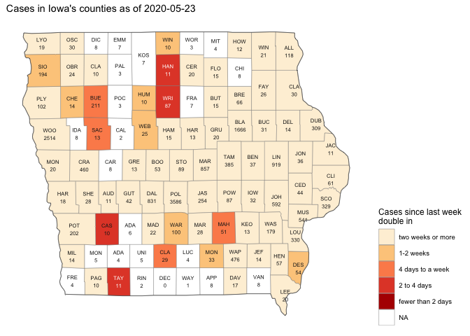

Covid-19-visualizations
================

Visualizations of the Covid-19 situation as it unfolds.

Post your favorite visualizations, make sure to explain the important
aspects.

  - [Ian Lyttle’s work](ijlyttle/README.md)

Links to great visualizations are also welcome\!

Generally: add what you want, but if you break it you fix it :)

John Hopkins and the NY Times are posting up-to-date information about
the number of Covid-19 cases.

## License

This work is licensed under a [Creative Commons Attribution 4.0
International License](https://creativecommons.org/licenses/by/4.0/).

## Examples

This chart shows the number of cases in Iowa - fill color shows recent
trend (last week) of the number of days in which cases double.

<!-- -->

-----

Here are a few of the charts, focusing on Iowa, that Ian has made, using
the [NYT data](https://github.com/nytimes/covid-19-data), [current
data](https://coronavirus.iowa.gov/pages/access) from the state, and
[county-population
data](https://www.icip.iastate.edu/tables/population/counties-estimates).

First is shows counties with large numbers of cases, also showing
aggregations for the state as a whole, as well as for counties not
otherwise
shown:

We can remake this plot in the style of [FT
charts](https://www.ft.com/coronavirus-latest):

What I’m seeing here is that counties race out of the gate, then settle
down to a doubling-rate between a week to two-weeks. This was the case
until April 19, where I am seeing an across-the-board increase. Almost
400 new cases reported on Apr. 19, doubling the previous record.
According to the governor, roughly two-thirds of these 400 cases are
associated with targeted testing at meat-packing plants (Louisa, Tama,
and Black Hawk).

Again, following the style of FT, we can look at the seven-day rolling
average of new
cases:

As of 2020-04-20, I am **not** seeing a peak in new-cases being
approached.

Focusing on Johnson County, I see four waves of increases:

  - days 0-7: the initial cases associated with the Egyptian cruise
  - days 7-23: the establishment of community-spread
  - days 23-38: another rise perhaps associated with spring-breakers
    returning
  - days 38- : another uptick

Another interesting case is Dallas County, known as being the
fastest-growing county in the state, i.e. suburban Des Moines:

  - days 0-16: new cases diminish, perhaps folks who have the means to
    isolate are doing so.
  - days 17- : there is a meat-packing plant in Perry with an outbreak.

Another question I want to ask deals with differences between large
counties and and small counties. My idea was to split the counties into
groups, according to population. Each group of counties has
approximately the same
population:

Essentially, a quarter of the state’s population lives in the two
most-populous counties. Also, about a quarter of the state’s population
lives in the sixty-or-so least-populous counties.

This lets us compare counts among the different
county-groups:

The proportion of reported cases is not terribly different from the
proportion of the population itself. That said, the largest counties
account for a little more than half the deaths; I think this is due to
the long-term care outbreaks, particularly in Linn County.

Finally, I’d like to show the seven-day rolling average of new-cases,
according to
group:

This suggests to me that, since the last week of March, roughly the same
things are happenning all over the state, regardless of the
county-group. It could be that larger counties have more long-term care
facilites and that smaller counties have more meat-packing plants.

Since about April 18, I am starting to see a divergence in the rate of
new cases among the groups. I suspect this is because Black Hawk and
Woodbury counties, mid-large counties, each have significant outbreaks
associated with meat-packing plants.

This is my opinion, but rather than explaining using extenuating
circumstances, I think the call to action is that we need to do more to
protect our vulnerablities, including meat-packing plants, long-term
care facilities, and hopsitals. We *all* have a role to play in reducing
the spread.
