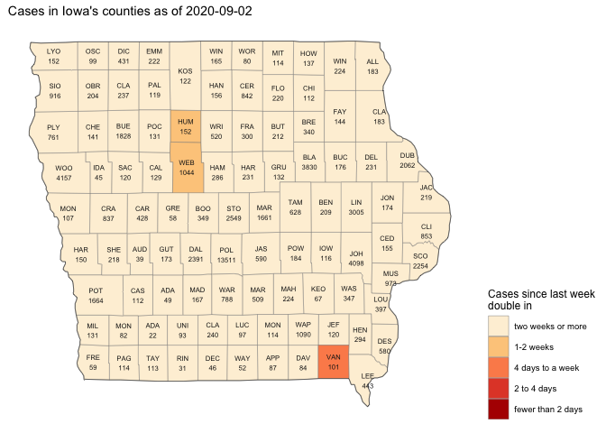

Covid-19-visualizations
================

Visualizations of the Covid-19 situation as it unfolds.

Post your favorite visualizations, make sure to explain the important
aspects.

Links to great visualizations are also welcome\!

Generally: add what you want, but if you break it you fix it :)

John Hopkins and the NY Times are posting up-to-date information about
the number of Covid-19 cases.

<!-- -->
