COVID-19 Iowa
================
Ian Lyttle
2020-04-13

``` r
library("fs")
library("glue")
library("tidyverse")
```

    ## ── Attaching packages ────────────────────────────────────────────────────────────────────── tidyverse 1.3.0 ──

    ## ✓ ggplot2 3.3.0          ✓ purrr   0.3.3     
    ## ✓ tibble  2.1.3          ✓ dplyr   0.8.4     
    ## ✓ tidyr   1.0.0          ✓ stringr 1.4.0     
    ## ✓ readr   1.3.1.9000     ✓ forcats 0.4.0

    ## ── Conflicts ───────────────────────────────────────────────────────────────────────── tidyverse_conflicts() ──
    ## x dplyr::collapse() masks glue::collapse()
    ## x dplyr::filter()   masks stats::filter()
    ## x dplyr::lag()      masks stats::lag()

``` r
library("readxl")
library("USAboundaries") # also install_github("ropensci/USAboundariesData")
library("sf")
```

    ## Linking to GEOS 3.7.2, GDAL 2.4.2, PROJ 5.2.0

``` r
library("colorspace")
library("RcppRoll")
```

``` r
dir_source <- path("data", "download")
dir_target <- path("data", "iowa")

dir_create(dir_target)
```

## Prepare data

Let’s read in the county data:

``` r
us_counties <- 
  read_csv(path(dir_source, "us-counties.csv"))
```

    ## Parsed with column specification:
    ## cols(
    ##   date = col_date(format = ""),
    ##   county = col_character(),
    ##   state = col_character(),
    ##   fips = col_character(),
    ##   cases = col_double(),
    ##   deaths = col_double()
    ## )

For now, let’s get the Iowa data, only a few of the columns, and we will
create a column to note the type of aggregation (“none” for the
county-level data).

``` r
iowa_counties <-
  us_counties %>%
  filter(state == "Iowa") %>%
  select(date, county, cases, deaths) %>%
  group_by(county) %>%
  arrange(date) %>%
  mutate(
    new_cases = cases - lag(cases, default = 0),
    new_deaths = deaths - lag(deaths, default = 0),
    new_cases_week_avg = (cases - lag(cases, n = 7, default = 0)) / 7,
    new_deaths_week_avg = (deaths - lag(deaths, n = 7, default = 0)) / 7,
    aggregation = "none"
  ) %>%
  ungroup() %>%
  arrange(desc(date), desc(cases)) %>%
  print()
```

    ## # A tibble: 1,383 x 9
    ##    date       county cases deaths new_cases new_deaths new_cases_week_…
    ##    <date>     <chr>  <dbl>  <dbl>     <dbl>      <dbl>            <dbl>
    ##  1 2020-04-12 Linn     243     18         8          6           11.7  
    ##  2 2020-04-12 Johns…   203      2         9          0           13.9  
    ##  3 2020-04-12 Polk     177      5        14          0            7.86 
    ##  4 2020-04-12 Scott    115      1         4          0           10.6  
    ##  5 2020-04-12 Musca…    96      1         5          0            9    
    ##  6 2020-04-12 Tama      86      2         9          0            8    
    ##  7 2020-04-12 Washi…    81      4         2          1            4.57 
    ##  8 2020-04-12 Louisa    76      0         6          0           10    
    ##  9 2020-04-12 Black…    47      0         6          0            5    
    ## 10 2020-04-12 Dallas    37      0         0          0            0.286
    ## # … with 1,373 more rows, and 2 more variables: new_deaths_week_avg <dbl>,
    ## #   aggregation <chr>

Let’s have a quick look at all the counties.

``` r
ggplot(iowa_counties, aes(date, cases)) +
  geom_line(aes(color = county)) +
  scale_y_log10()
```

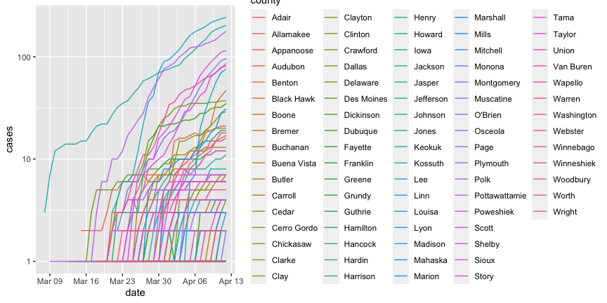<!-- -->

This plot is not all that informative, except to tell us that we have
the data we expect.

Let’s get just the data for the most-current data.

``` r
iowa_counties_current <- 
  iowa_counties %>%
  filter(date == max(date)) %>%
  arrange(desc(cases)) %>%
  print()
```

    ## # A tibble: 81 x 9
    ##    date       county cases deaths new_cases new_deaths new_cases_week_…
    ##    <date>     <chr>  <dbl>  <dbl>     <dbl>      <dbl>            <dbl>
    ##  1 2020-04-12 Linn     243     18         8          6           11.7  
    ##  2 2020-04-12 Johns…   203      2         9          0           13.9  
    ##  3 2020-04-12 Polk     177      5        14          0            7.86 
    ##  4 2020-04-12 Scott    115      1         4          0           10.6  
    ##  5 2020-04-12 Musca…    96      1         5          0            9    
    ##  6 2020-04-12 Tama      86      2         9          0            8    
    ##  7 2020-04-12 Washi…    81      4         2          1            4.57 
    ##  8 2020-04-12 Louisa    76      0         6          0           10    
    ##  9 2020-04-12 Black…    47      0         6          0            5    
    ## 10 2020-04-12 Dallas    37      0         0          0            0.286
    ## # … with 71 more rows, and 2 more variables: new_deaths_week_avg <dbl>,
    ## #   aggregation <chr>

It could be useful to see the current distribution of number of cases
per county:

``` r
date_max <- unique(iowa_counties_current$date)

ggplot(iowa_counties_current) +
  geom_histogram(aes(x = cases), binwidth = 2) +
  theme_bw() + 
  labs(
    x = "number of reported cases in county",
    y = "number of counties",
    title = glue("Iowa: distribution of counties by number of COVID-19 cases - {date_max}"),
    caption = params$nyt_citation  
  ) 
```

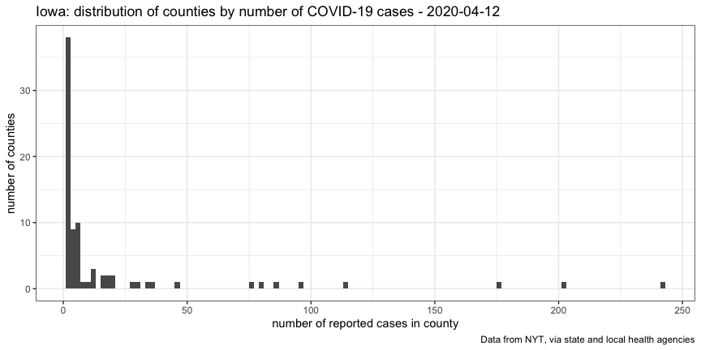<!-- -->

On the right, we see Johnson, Polk, and Linn counties, with the greatest
number of reported cases. On the left, we see a lot of counties with
only a few cases.

Our eyes will let us pay attention to only a finite number of things at
a time, so I propose to set a threshold of 50 cases. We identify those
counties where the number of cases is greater than or equal to the
threshold.

``` r
counties_large <- 
  iowa_counties_current %>%
  filter(cases >= params$threshold_cases) %>%
  arrange(desc(cases)) %>%
  pull(county)

counties_large
```

    ## [1] "Linn"       "Johnson"    "Polk"       "Scott"      "Muscatine" 
    ## [6] "Tama"       "Washington" "Louisa"

In addition to compiliing the data for the counties with large numbers
of cases, we also create aggregeted datasets that show:

  - the total for the entire state.
  - the total for all the counties that are not considered individually.

<!-- end list -->

``` r
iowa_total <- 
  iowa_counties %>%
  group_by(date) %>%
  summarize(
    county = factor(NA_character_, levels = counties_large),
    cases = sum(cases),
    deaths = sum(deaths),
    new_cases = sum(new_cases),
    new_deaths = sum(new_deaths),
    new_cases_week_avg = sum(new_cases_week_avg),
    new_deaths_week_avg = sum(new_deaths_week_avg),
    aggregation = "total"
  ) %>%
  arrange(desc(date)) %>%
  print()
```

    ## # A tibble: 36 x 9
    ##    date       county cases deaths new_cases new_deaths new_cases_week_…
    ##    <date>     <fct>  <dbl>  <dbl>     <dbl>      <dbl>            <dbl>
    ##  1 2020-04-12 <NA>    1587     41        77          7            103. 
    ##  2 2020-04-11 <NA>    1510     34       122          3            103. 
    ##  3 2020-04-10 <NA>    1388     31       118          4             98.4
    ##  4 2020-04-09 <NA>    1270     27       125          0             93.7
    ##  5 2020-04-08 <NA>    1145     27        97          1             85.3
    ##  6 2020-04-07 <NA>    1048     26       102          1             78.6
    ##  7 2020-04-06 <NA>     946     25        78          3             74.6
    ##  8 2020-04-05 <NA>     868     22        82         11             76  
    ##  9 2020-04-04 <NA>     786     11        87          0             69.7
    ## 10 2020-04-03 <NA>     699     11        85          0             66.1
    ## # … with 26 more rows, and 2 more variables: new_deaths_week_avg <dbl>,
    ## #   aggregation <chr>

``` r
iowa_remainder <- 
  iowa_counties %>%
  filter(!(county %in% counties_large)) %>%
  group_by(date) %>%
  summarize(
    county = factor(NA_character_, levels = counties_large),
    cases = sum(cases),
    deaths = sum(deaths),
    new_cases = sum(new_cases),
    new_deaths = sum(new_deaths),
    new_cases_week_avg = sum(new_cases_week_avg),
    new_deaths_week_avg = sum(new_deaths_week_avg),
    aggregation = "remainder"
  ) %>%
  arrange(desc(date)) %>%
  print()
```

    ## # A tibble: 35 x 9
    ##    date       county cases deaths new_cases new_deaths new_cases_week_…
    ##    <date>     <fct>  <dbl>  <dbl>     <dbl>      <dbl>            <dbl>
    ##  1 2020-04-12 <NA>     510      8        20          0             27.1
    ##  2 2020-04-11 <NA>     490      8        34          2             27.1
    ##  3 2020-04-10 <NA>     456      6        39          0             25.3
    ##  4 2020-04-09 <NA>     417      6        26          0             24.6
    ##  5 2020-04-08 <NA>     391      6        26          0             25.9
    ##  6 2020-04-07 <NA>     365      6        25          1             25  
    ##  7 2020-04-06 <NA>     340      5        20          0             25  
    ##  8 2020-04-05 <NA>     320      5        20          2             26.1
    ##  9 2020-04-04 <NA>     300      3        21          0             25.4
    ## 10 2020-04-03 <NA>     279      3        34          0             26  
    ## # … with 25 more rows, and 2 more variables: new_deaths_week_avg <dbl>,
    ## #   aggregation <chr>

``` r
iowa_counties_large <- 
  iowa_counties %>%
  filter(county %in% counties_large) %>%
  mutate(
    county = factor(county, levels = counties_large)
  )
```

Let’s combine our
datasets:

``` r
data_combined <- bind_rows(iowa_counties_large, iowa_total, iowa_remainder)
```

If we wanted do one of those [FT-style
charts](https://www.ft.com/coronavirus-latest), we need to choose an
index day for each county and aggregation. We choose an arbitrary
threshold of 20 reported cases.

``` r
data_combined_index <- 
  data_combined %>%
  group_by(aggregation, county) %>%
  arrange(date) %>%
  mutate(
    exceeds_threshold_cases = cases >= params$threshold_index_cases,
    index_cases = cumsum(exceeds_threshold_cases) - 1,
    exceeds_threshold_new_cases = new_cases >= params$threshold_new_cases,
    index_new_cases = cumsum(cumany(exceeds_threshold_new_cases)) - 1
  ) 
```

    ## Warning: Factor `county` contains implicit NA, consider using
    ## `forcats::fct_explicit_na`
    
    ## Warning: Factor `county` contains implicit NA, consider using
    ## `forcats::fct_explicit_na`
    
    ## Warning: Factor `county` contains implicit NA, consider using
    ## `forcats::fct_explicit_na`

We combine all these datasets into a plot:

``` r
plot_cases <- 
  ggplot(data_combined, aes(date, cases)) +
  geom_line(aes(color = county, linetype = aggregation)) +
  geom_point(
    data = . %>% filter(date == max(date)),
    aes(color = county),
    show.legend = FALSE
  ) +
  scale_y_log10(sec.axis = dup_axis(name = NULL)) + 
  scale_linetype(
    name = "grouping", 
    breaks = c("total", "remainder", "none"),
    labels = c("state total", "all other counties", "county")
  ) +
  scale_color_discrete(breaks = counties_large) +
  theme_bw() + 
  labs(
    x = NULL,
    y = "number of reported cases",
    title = "Iowa: COVID-19 cases by reporting date",
    subtitle = "Includes counties with most reported cases, also aggregations",
    caption = params$nyt_citation  
  )
```

``` r
plot_new_cases_week_avg <- 
  ggplot(data_combined, aes(date, new_cases_week_avg)) +
  geom_line(aes(color = county, linetype = aggregation)) +
  geom_point(
    data = . %>% filter(date == max(date)),
    aes(color = county),
    show.legend = FALSE
  ) +
  scale_y_log10(sec.axis = dup_axis(name = NULL)) + 
  scale_linetype(
    name = "grouping", 
    breaks = c("total", "remainder", "none"),
    labels = c("state total", "all other counties", "county")
  ) +
  scale_color_discrete(breaks = counties_large) +
  theme_bw() + 
  labs(
    x = NULL,
    y = "number of new reported cases",
    title = "Iowa: COVID-19 daily new cases (7-day rolling average) by reporting date",
    subtitle = "Includes counties with most reported cases, also aggregations",
    caption = params$nyt_citation  
  )
```

``` r
# function that takes a set of limits, returns the breaks
# - we want breaks every 7 days.
f_break <- function(limits) {

  low <- floor(limits[1] / 7) * 7
  hi <- ceiling(limits[2] / 7) * 7
  
  seq(low, hi, by = 7)
}

# function that returns data for "doubling" lines
#' @param data          `data.frame`
#' @param var_index     `character`, name of variable in `data` containing day-index
#' @param var_number    `character`, name of variable in `data` contiaining number-data
#' @param days_doubling `numeric`, vector with number-of-days to include
#'
#' @return `data.frame` with variables `days_doubling`, `index`, `number`, `label`
#'
f_doubling <- function(data, var_index, var_number, threshold_number,
                       days_doubling = c(2, 4, 7, 14)) {

  index_range <- range(data[[var_index]])
  number_range <- range(data[[var_number]])
  
  max_number <- number_range[2]
  max_index <- index_range[2]

  # for each `days_doubling`, determine the index when days are maximum 
  by_number <- 
    crossing(days_doubling, number = max_number) %>%
    mutate(
      index = days_doubling * log(number/threshold_number, 2)
    )
    
  by_index <- 
    crossing(days_doubling, index = index_range) %>%
    mutate(
      number = threshold_number * 2^(index/days_doubling)
    )

  combined <- 
    dplyr::bind_rows(by_index, by_number) %>%
    dplyr::select(days_doubling, index, number) %>%
    dplyr::mutate(
      label = ifelse(index > 0, glue::glue("{days_doubling}-day doubling"), "")
    ) %>%
    dplyr::filter(index <= max_index, number <= max_number) %>%
    dplyr::arrange(days_doubling, index) 
  
  combined
}

plot_cases_ft <- 
  ggplot(
    data_combined_index %>% filter(index_cases >= 0), 
    aes(index_cases, cases)
  ) +
  geom_line(
    data = 
      . %>% 
      f_doubling("index_cases", "cases", params$threshold_index_cases), 
    aes(x = index, y = number, group = factor(days_doubling)),
    color = "grey80",
    linetype = "twodash"
  ) +
  geom_text(
    data = 
      . %>% 
      f_doubling("index_cases", "cases", params$threshold_index_cases) %>%
      filter(str_length(label) > 0), 
    aes(x = index, y = number, group = factor(days_doubling), label = label),
    hjust = "right", 
    nudge_y = 0.05,
    color = "grey80"
  ) +
  geom_line(aes(color = county, linetype = aggregation)) +
  geom_point(
    data = . %>% filter(date == max(date)),
    aes(color = county),
    show.legend = FALSE
  ) +
  scale_x_continuous(breaks = f_break) +
  scale_y_log10(
    sec.axis = dup_axis(name = NULL)
  ) + 
  scale_linetype(
    name = "grouping", 
    breaks = c("total", "remainder", "none"),
    labels = c("state total", "all other counties", "county")
  ) +
  scale_color_discrete(breaks = counties_large) +
  theme_bw() +
  labs(
    x = glue("days since {params$threshold_index_cases} cases"),
    y = "number of reported cases",
    title = "Iowa: COVID-19 cumulative-case trajectories",
    subtitle = "Includes counties with most reported cases, also aggregations",
    caption = params$nyt_citation
  )
```

``` r
plot_new_cases_week_avg_ft <- 
  ggplot(
    data_combined_index %>% filter(index_new_cases >= 0),
    aes(index_new_cases, new_cases_week_avg)
  ) +
  geom_line(aes(color = county, linetype = aggregation)) +
  geom_point(
    data = . %>% filter(date == max(date)),
    aes(color = county),
    show.legend = FALSE
  ) +
  scale_x_continuous(breaks = f_break) +
  scale_y_log10(
    sec.axis = dup_axis(name = NULL)
  ) + 
  scale_linetype(
    name = "grouping", 
    breaks = c("total", "remainder", "none"),
    labels = c("state total", "all other counties", "county")
  ) +
  scale_color_discrete(breaks = counties_large) +
  theme_bw() +
  labs(
    x = glue("days since {params$threshold_index_new_cases} new cases"),
    y = "number of new reported cases",
    title = "Iowa: COVID-19 new-case trajectories (7-day rolling average)",
    subtitle = "Includes counties with most reported cases, also aggregations",
    caption = params$nyt_citation
  )
```

### County groups

Let’s look at the poulation of counties. I’d like to sort Iowa’s
counties into four groups, ordered by county-population, such that each
*group* of counties contains approximately the same population.

``` r
iowa_county_population <-
  read_xls(
    path = path(dir_source, "iowa_counties_population.xls"), 
    sheet = "Counties", 
    range = "A7:M107"
  ) %>%
  transmute(
    fips = Fips,
    county = str_replace(Area, " County, Iowa", ""),
    population = `2019`
  ) %>%
  filter(fips > 19) %>%
  arrange(population) %>%
  mutate(
    cumulative_poulation = cumsum(population),
    quartile_population = cumulative_poulation/max(cumulative_poulation),
    population_group = cut(
      quartile_population, 
      breaks = c(0, 0.25, 0.51, 0.78, 1),
      labels = c("small", "mid-small", "mid-large", "large")
      # labels = c("FT-AA", "PW-HN", "ST-DA", "PK-LN")
    ),
    population_group = fct_rev(population_group)
  ) %>%
  arrange(desc(cumulative_poulation)) %>%
  print()
```

    ## # A tibble: 99 x 6
    ##     fips county   population cumulative_poula… quartile_popula… population_group
    ##    <dbl> <chr>         <dbl>             <dbl>            <dbl> <fct>           
    ##  1 19153 Polk         490161           3155070            1     large           
    ##  2 19113 Linn         226706           2664909            0.845 large           
    ##  3 19163 Scott        172943           2438203            0.773 mid-large       
    ##  4 19103 Johnson      151140           2265260            0.718 mid-large       
    ##  5 19013 Black H…     131228           2114120            0.670 mid-large       
    ##  6 19193 Woodbury     103107           1982892            0.628 mid-large       
    ##  7 19061 Dubuque       97311           1879785            0.596 mid-large       
    ##  8 19169 Story         97117           1782474            0.565 mid-large       
    ##  9 19049 Dallas        93453           1685357            0.534 mid-large       
    ## 10 19155 Pottawa…      93206           1591904            0.505 mid-small       
    ## # … with 89 more rows

You can see that the “first” group contains two counties: Polk and Linn;
the “second” group contains seven counties, from Scott to Dallas. This
second group of counties is home to the Regents’ Universities, Iowa’s
part of the Quad cities, Dubuque, Sioux City, and suburban Des Moines.

The “third” and “fourth” groups contain 24 and 66 counties,
respectively. Here’s a map of Iowa’s counties, showing these groups:

``` r
iowa_map <- us_counties(resolution = "low", state = "Iowa")
```

I am interested to compare how the trajectory of recorded cases behaves,
or might behave differently, among these groups of counties.

``` r
group_colors <- 
  colorspace::sequential_hcl(palette = "Blues 3", n = 6)[1:4] # drop lightest

iowa_map_with_group <- 
  iowa_map %>%
  left_join(
    iowa_county_population %>% select(county, population_group),
    by = c(name = "county")  
  )
```

``` r
plot_iowa_map_group <-
  ggplot() +
  geom_sf(
    data = iowa_map_with_group, 
    aes(fill = population_group),
    color = "white"
  ) + 
  scale_fill_manual(values = group_colors) + 
  labs(
    title = "Iowa counties by population-group",
    subtitle = "Each population-group has about 1/4 of state's population (2019 estimate)",
    caption = params$iowa_citation,
    fill = "group"
  ) +
  theme_minimal() +
  theme(
    panel.grid.major = element_blank(),
    axis.text = element_blank()
  )
```

Let’s look at proportions of counties, population, and (most-recent)
reported cases and deaths.

``` r
iowa_counts <-
  iowa_county_population %>% select(county, population, population_group) %>%
  left_join(
    iowa_counties_current,
    by = "county"
  ) %>%
  mutate(
    cases = ifelse(is.na(cases), 0, cases),
    deaths = ifelse(is.na(deaths), 0, deaths)
  ) %>%
  group_by(population_group) %>%
  summarize(
    counties = n(),
    population = sum(population),
    cases = sum(cases),
    deaths = sum(deaths)
  ) %>%
  print()
```

    ## # A tibble: 4 x 5
    ##   population_group counties population cases deaths
    ##   <fct>               <int>      <dbl> <dbl>  <dbl>
    ## 1 large                   2     716867   420     23
    ## 2 mid-large               7     846299   462      4
    ## 3 mid-small              24     812518   382      7
    ## 4 small                  66     779386   323      7

``` r
vars_count <- c("counties", "population", "cases", "deaths")

iowa_counts_tall <-
  iowa_counts %>%
  pivot_longer(
    all_of(vars_count), 
    names_to = "category", 
    values_to = "count"
  ) %>%
  mutate(
    category = factor(category, rev(vars_count))
  ) %>%
  print()
```

    ## # A tibble: 16 x 3
    ##    population_group category    count
    ##    <fct>            <fct>       <dbl>
    ##  1 large            counties        2
    ##  2 large            population 716867
    ##  3 large            cases         420
    ##  4 large            deaths         23
    ##  5 mid-large        counties        7
    ##  6 mid-large        population 846299
    ##  7 mid-large        cases         462
    ##  8 mid-large        deaths          4
    ##  9 mid-small        counties       24
    ## 10 mid-small        population 812518
    ## 11 mid-small        cases         382
    ## 12 mid-small        deaths          7
    ## 13 small            counties       66
    ## 14 small            population 779386
    ## 15 small            cases         323
    ## 16 small            deaths          7

``` r
plot_iowa_proportions <-
  ggplot(
    iowa_counts_tall, 
    aes(x = category, y = count)
  ) + 
  geom_col(aes(fill = population_group), position = position_fill(reverse = TRUE)) + 
  scale_y_continuous(labels = scales::percent) +
  scale_fill_manual(values = group_colors) + 
  coord_flip() +
  labs(
    x = "",
    y = "proportion",
    fill = "group",
    title = glue("Iowa: COVID-19 proportions - as of {date_max}"),
    caption = params$nyt_citation
  ) +
  theme_bw()
```

``` r
iowa_counties_group <-
  iowa_counties %>%
  left_join(
    iowa_county_population %>% select(county, population_group),
    by = "county"
  )

iowa_counties_group_agg <-
  iowa_counties_group %>%
  group_by(date, population_group) %>%
  summarize(
    cases = sum(cases),
    deaths = sum(deaths),
    new_cases = sum(new_cases),
    new_deaths = sum(new_deaths),
    new_cases_week_avg = sum(new_cases_week_avg),
    new_deaths_week_avg = sum(new_deaths_week_avg)
  ) %>%
  ungroup()
```

``` r
plot_cases_group <- 
  ggplot(iowa_counties_group_agg, aes(date, cases)) +
  geom_line(
    aes(color = population_group)
  ) +  
  geom_point(
    data = . %>% filter(date == max(date)),
    aes(color = population_group),
    show.legend = FALSE
  ) +
  scale_color_manual(values = group_colors) +
  scale_y_log10(sec.axis = dup_axis(name = NULL)) + 
  theme_bw() + 
  labs(
    x = NULL,
    y = "number of reported cases",
    color = "group",
    title = "Iowa: COVID-19 cases by reporting date",
    caption = params$nyt_citation  
  )
```

``` r
plot_new_cases_group <- 
  ggplot(iowa_counties_group_agg, aes(date, new_cases_week_avg)) +
  geom_line(
    aes(color = population_group)
  ) +  
  geom_point(
    data = . %>% filter(date == max(date)),
    aes(color = population_group),
    show.legend = FALSE
  ) +
  scale_color_manual(values = group_colors) +
  scale_y_log10(sec.axis = dup_axis(name = NULL)) + 
  theme_bw() + 
  labs(
    x = NULL,
    y = "number of new reported cases",
    color = "group",
    title = "Iowa: COVID-19 daily new cases (7-day rolling average) by reporting date",
    caption = params$nyt_citation  
  )
```

``` r
iowa_counties_group_agg_ft <- 
  iowa_counties_group_agg %>%
  group_by(population_group) %>%
  arrange(date) %>%
  mutate(
    exceeds_threshold_cases = cases > params$threshold_index_cases,
    index_cases = cumsum(exceeds_threshold_cases) - 1,
    exceeds_threshold_new_cases = new_cases >= params$threshold_index_new_cases,
    index_new_cases = cumsum(cumany(exceeds_threshold_new_cases)) - 1    
  ) 

plot_cases_group_ft <-
  ggplot(
    iowa_counties_group_agg_ft %>% filter(exceeds_threshold_cases), 
    aes(index_cases, cases)) +
  geom_line(
    data = 
      . %>% 
      f_doubling("index_cases", "cases", params$threshold_index_cases), 
    aes(x = index, y = number, group = factor(days_doubling)),
    color = "grey80",
    linetype = "twodash"
  ) +
  geom_text(
    data = 
      . %>% 
      f_doubling("index_cases", "cases", params$threshold_index_cases) %>%
      filter(str_length(label) > 0), 
    aes(x = index, y = number, label = label),
    hjust = "right", 
    nudge_y = 0.05,
    color = "grey80"
  ) +
  geom_line(aes(color = population_group)) +
  geom_point(
    data = . %>% filter(date == max(date)),
    aes(color = population_group),
    show.legend = FALSE
  ) +
  scale_x_continuous(breaks = f_break) +
  scale_y_log10(
    sec.axis = dup_axis(name = NULL)
  ) + 
  scale_color_manual(values = group_colors) +
  theme_bw() +
  labs(
    x = glue("days since {params$threshold_index_cases} cases"),
    y = "number of reported cases",
    color = "group",
    title = "Iowa: COVID-19 cumulative-case trajectories",
    caption = params$nyt_citation
  )
```

``` r
plot_new_cases_group_ft <-
  ggplot(
    iowa_counties_group_agg_ft %>% filter(index_new_cases >= 0), 
    aes(index_new_cases, new_cases_week_avg)) +
  geom_line(aes(color = population_group)) +
  geom_point(
    data = . %>% filter(date == max(date)),
    aes(color = population_group),
    show.legend = FALSE
  ) +
  scale_x_continuous(breaks = f_break) +
  scale_y_log10(
    sec.axis = dup_axis(name = NULL)
  ) + 
  scale_color_manual(values = group_colors) +
  theme_bw() +
  labs(
    x = glue("days since {params$threshold_index_new_cases} new cases"),
    y = "number of new reported cases",
    color = "group",
    title = "Iowa: COVID-19 new-case trajectories (7-day rolling average)",
    caption = params$nyt_citation
  )
```

## Discussion

``` r
plot_cases
```

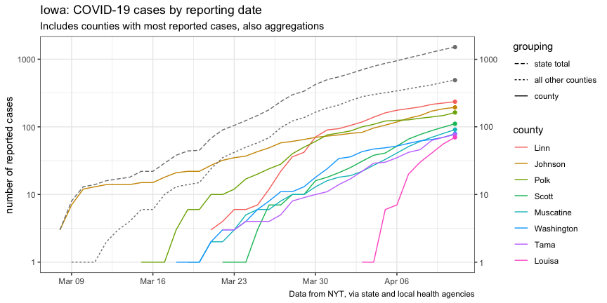<!-- -->

To be *very* clear, I am not an epidemiologist, so it is entirely
possible that I am missing some important nuance here.

Assuming that testing standards do not vary (too much) across the state,
and remain relatively constant over time, here’s what I’m seeing from
this plot:

  - Considering the state total, cases are doubling every seven-or-so
    days.

  - The rate-of-growth for “all other counties” is tracking the
    rate-of-growth for the state, as a whole. This appears to be the
    case for the last two weeks.

Opinion/conjecture:

  - What we are seeing reported is a sense of what was *actually*
    happening a week or so previous.

  - By saying that we, as a state, don’t need to be doing anything
    differently, we are also saying that we are prepared to accept the
    doubling of cases every week days for the forseeable future.

For another view, here’s an [FT-style
chart](https://www.ft.com/coronavirus-latest):

``` r
plot_cases_ft
```

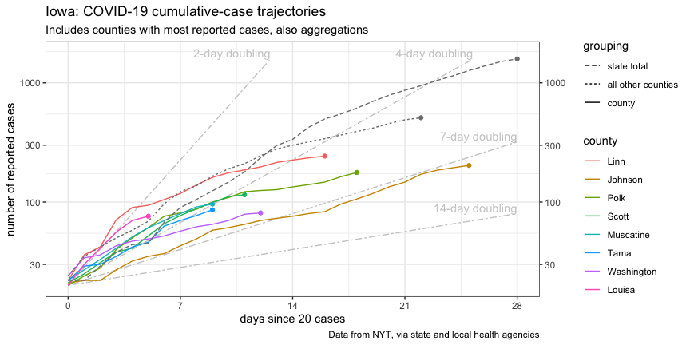<!-- -->

``` r
plot_new_cases_week_avg
```

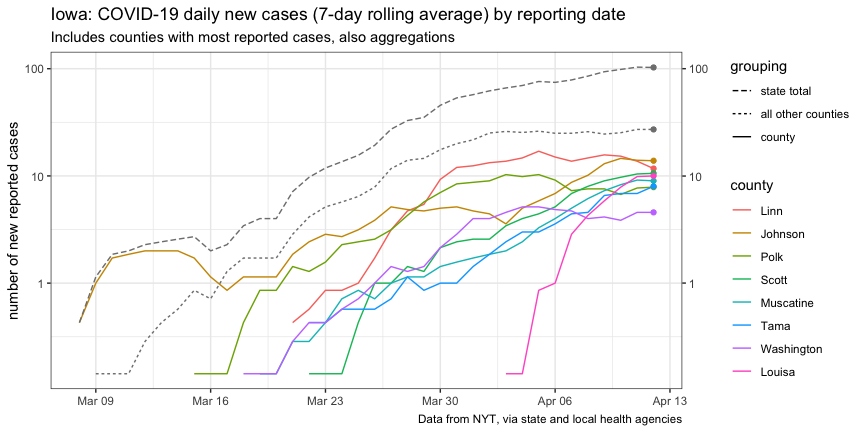<!-- -->

``` r
plot_new_cases_week_avg_ft
```

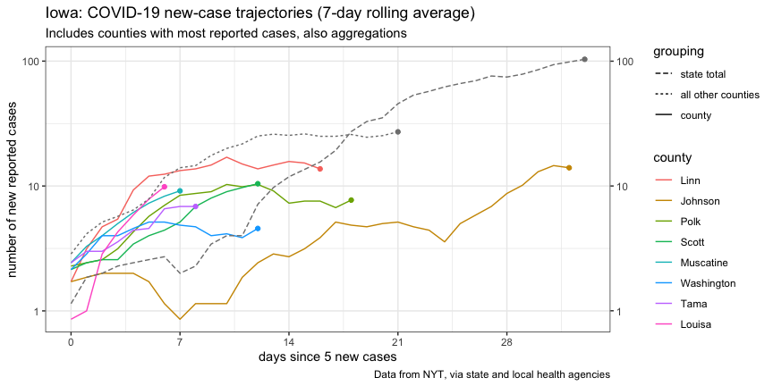<!-- -->

``` r
plot_iowa_map_group
```

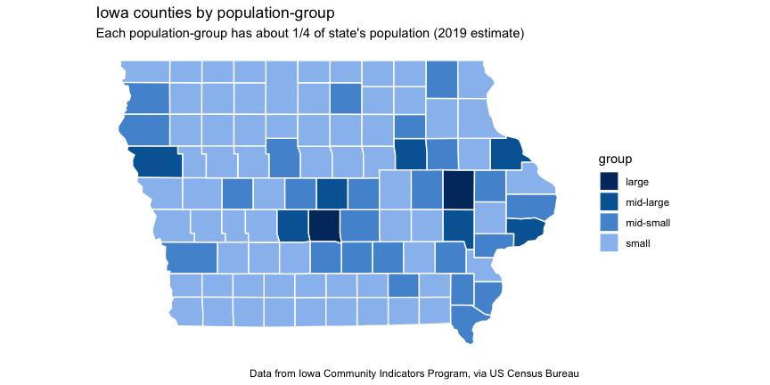<!-- -->

``` r
plot_iowa_proportions
```

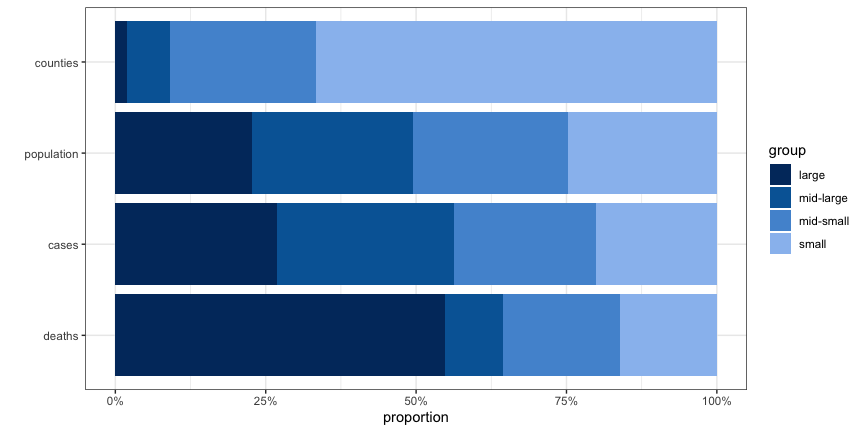<!-- -->

``` r
plot_cases_group
```

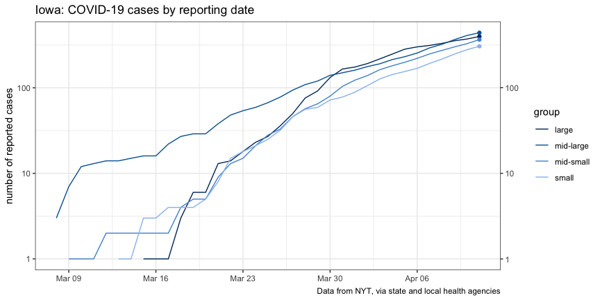<!-- -->

``` r
plot_new_cases_group
```

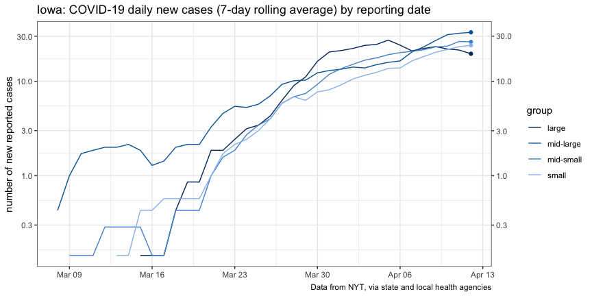<!-- -->

``` r
plot_cases_group_ft
```

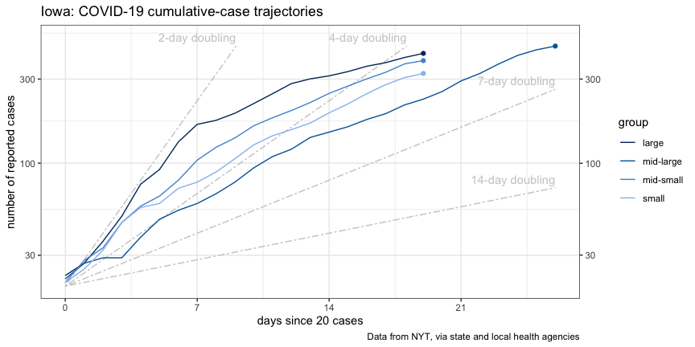<!-- -->

``` r
plot_new_cases_group_ft
```

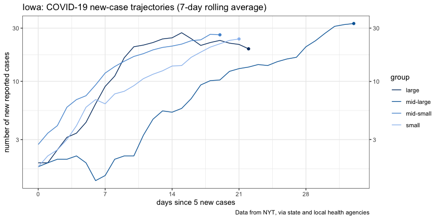<!-- -->
