COVID-19 Iowa
================
Ian Lyttle
2020-07-07

``` r
library("fs")
library("glue")
library("tidyverse")
```

    ## ── Attaching packages ────────────────────────────────────────────────────────────────── tidyverse 1.3.0 ──

    ## ✓ ggplot2 3.3.0          ✓ purrr   0.3.3     
    ## ✓ tibble  2.1.3          ✓ dplyr   1.0.0     
    ## ✓ tidyr   1.0.0          ✓ stringr 1.4.0     
    ## ✓ readr   1.3.1.9000     ✓ forcats 0.4.0

    ## ── Conflicts ───────────────────────────────────────────────────────────────────── tidyverse_conflicts() ──
    ## x dplyr::collapse() masks glue::collapse()
    ## x dplyr::filter()   masks stats::filter()
    ## x dplyr::lag()      masks stats::lag()

``` r
library("USAboundaries") # also install_github("ropensci/USAboundariesData")
library("sf")
```

    ## Linking to GEOS 3.7.2, GDAL 2.4.2, PROJ 5.2.0

``` r
library("colorspace")
```

``` r
dir_source <- path("data", "wrangle")
dir_target <- path("data", "iowa")

dir_create(dir_target)
```

## Prepare data

Let’s read in the county data:

``` r
iowa_counties <- 
  read_csv(path(dir_source, "iowa-counties.csv")) %>%
  print()
```

    ## Parsed with column specification:
    ## cols(
    ##   date = col_date(format = ""),
    ##   county = col_character(),
    ##   cases = col_double(),
    ##   deaths = col_double(),
    ##   new_cases = col_double(),
    ##   new_deaths = col_double(),
    ##   new_cases_week_avg = col_double(),
    ##   new_deaths_week_avg = col_double(),
    ##   aggregation = col_character()
    ## )

    ## # A tibble: 9,502 x 9
    ##    date       county cases deaths new_cases new_deaths new_cases_week_…
    ##    <date>     <chr>  <dbl>  <dbl>     <dbl>      <dbl>            <dbl>
    ##  1 2020-07-07 Polk    6681    180        43          0            90.7 
    ##  2 2020-07-07 Woodb…  3257     44         5          0            12.4 
    ##  3 2020-07-07 Black…  2315     58        13          0            30.3 
    ##  4 2020-07-07 Buena…  1715     11         1          0             2.86
    ##  5 2020-07-07 Johns…  1325      8        11          0            25   
    ##  6 2020-07-07 Linn    1296     82         0          0            13.3 
    ##  7 2020-07-07 Dallas  1286     29         6          0            15.7 
    ##  8 2020-07-07 Marsh…  1055     19         6          0             6.14
    ##  9 2020-07-07 Scott    817     10         1          0            25.4 
    ## 10 2020-07-07 Story    793      3        14          0            13.4 
    ## # … with 9,492 more rows, and 2 more variables: new_deaths_week_avg <dbl>,
    ## #   aggregation <chr>

Let’s have a quick look at all the counties.

``` r
ggplot(iowa_counties, aes(date, cases)) +
  geom_line(aes(color = county)) +
  scale_y_log10()
```

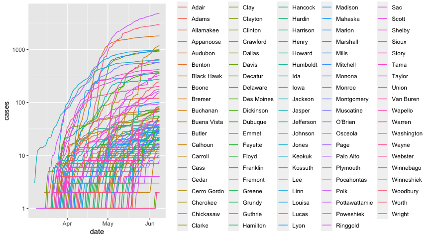<!-- -->

This plot is not all that informative, except to tell us that we have
the data we expect.

Let’s get just the data for the most-current data.

``` r
iowa_counties_current <- 
  iowa_counties %>%
  filter(date == max(date)) %>%
  arrange(desc(cases)) %>%
  print()
```

    ## # A tibble: 99 x 9
    ##    date       county cases deaths new_cases new_deaths new_cases_week_…
    ##    <date>     <chr>  <dbl>  <dbl>     <dbl>      <dbl>            <dbl>
    ##  1 2020-07-07 Polk    6681    180        43          0            90.7 
    ##  2 2020-07-07 Woodb…  3257     44         5          0            12.4 
    ##  3 2020-07-07 Black…  2315     58        13          0            30.3 
    ##  4 2020-07-07 Buena…  1715     11         1          0             2.86
    ##  5 2020-07-07 Johns…  1325      8        11          0            25   
    ##  6 2020-07-07 Linn    1296     82         0          0            13.3 
    ##  7 2020-07-07 Dallas  1286     29         6          0            15.7 
    ##  8 2020-07-07 Marsh…  1055     19         6          0             6.14
    ##  9 2020-07-07 Scott    817     10         1          0            25.4 
    ## 10 2020-07-07 Story    793      3        14          0            13.4 
    ## # … with 89 more rows, and 2 more variables: new_deaths_week_avg <dbl>,
    ## #   aggregation <chr>

It could be useful to see the current distribution of number of cases
per county:

``` r
date_max <- unique(iowa_counties_current$date)

ggplot(iowa_counties_current) +
  geom_histogram(aes(x = cases), binwidth = 2) +
  theme_bw() + 
  labs(
    x = "number of reported cases in county",
    y = "number of counties",
    title = glue("Iowa: distribution of counties by number of COVID-19 cases - {date_max}"),
    caption = params$nyt_citation  
  ) 
```

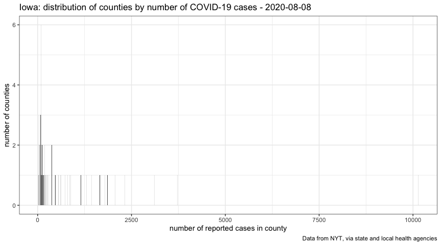<!-- -->

On the right, we see Johnson, Polk, and Linn counties, with the greatest
number of reported cases. On the left, we see a lot of counties with
only a few cases.

Our eyes will let us pay attention to only a finite number of things at
a time, so I propose to set a threshold of 50 cases. We identify those
counties where the number of cases is greater than or equal to the
threshold.

``` r
counties_large <- 
  iowa_counties_current %>%
  filter(cases >= params$threshold_cases) %>%
  arrange(desc(cases)) %>%
  pull(county)

counties_large
```

    ##  [1] "Polk"          "Woodbury"      "Black Hawk"    "Buena Vista"  
    ##  [5] "Johnson"       "Linn"          "Dallas"        "Marshall"     
    ##  [9] "Scott"         "Story"         "Pottawattamie" "Dubuque"      
    ## [13] "Wapello"       "Crawford"      "Muscatine"     "Sioux"        
    ## [17] "Tama"          "Wright"        "Louisa"        "Jasper"       
    ## [21] "Plymouth"      "Warren"        "Dickinson"     "Webster"      
    ## [25] "Washington"    "Hamilton"      "Cerro Gordo"   "Boone"        
    ## [29] "Clay"          "Clarke"        "Allamakee"     "Mahaska"      
    ## [33] "Shelby"        "Clinton"       "Poweshiek"     "Carroll"      
    ## [37] "Pocahontas"    "Bremer"        "Franklin"      "Des Moines"   
    ## [41] "O'Brien"       "Emmet"         "Henry"         "Cedar"        
    ## [45] "Taylor"        "Hardin"        "Monona"        "Cherokee"     
    ## [49] "Floyd"         "Marion"        "Benton"        "Guthrie"      
    ## [53] "Sac"           "Jefferson"     "Osceola"       "Jones"        
    ## [57] "Butler"        "Hancock"       "Buchanan"      "Humboldt"     
    ## [61] "Harrison"      "Lee"           "Calhoun"       "Iowa"         
    ## [65] "Monroe"        "Delaware"      "Fayette"

In addition to compiliing the data for the counties with large numbers
of cases, we also create aggregeted datasets that show:

  - the total for the entire state.
  - the total for all the counties that are not considered individually.

<!-- end list -->

``` r
iowa_total <- 
  iowa_counties %>%
  group_by(date) %>%
  summarize(
    county = factor(NA_character_, levels = counties_large),
    cases = sum(cases),
    deaths = sum(deaths),
    new_cases = sum(new_cases),
    new_deaths = sum(new_deaths),
    new_cases_week_avg = sum(new_cases_week_avg),
    new_deaths_week_avg = sum(new_deaths_week_avg),
    aggregation = "total"
  ) %>%
  arrange(desc(date)) %>%
  print()
```

    ## `summarise()` ungrouping output (override with `.groups` argument)

    ## # A tibble: 122 x 9
    ##    date       county cases deaths new_cases new_deaths new_cases_week_…
    ##    <date>     <fct>  <dbl>  <dbl>     <dbl>      <dbl>            <dbl>
    ##  1 2020-07-07 <NA>   31905    725       166          0             394.
    ##  2 2020-07-06 <NA>   31739    725       162          4             411.
    ##  3 2020-07-05 <NA>   31577    721       431          0             439.
    ##  4 2020-07-04 <NA>   31146    721       523          0             422.
    ##  5 2020-07-03 <NA>   30623    721       372          2             401.
    ##  6 2020-07-02 <NA>   30251    719       638          3             412.
    ##  7 2020-07-01 <NA>   29613    716       465          1             391.
    ##  8 2020-06-30 <NA>   29148    715       285          4             384.
    ##  9 2020-06-29 <NA>   28863    711       357          7             380 
    ## 10 2020-06-28 <NA>   28506    704       312          2             358.
    ## # … with 112 more rows, and 2 more variables: new_deaths_week_avg <dbl>,
    ## #   aggregation <chr>

``` r
iowa_remainder <- 
  iowa_counties %>%
  filter(!(county %in% counties_large)) %>%
  group_by(date) %>%
  summarize(
    county = factor(NA_character_, levels = counties_large),
    cases = sum(cases),
    deaths = sum(deaths),
    new_cases = sum(new_cases),
    new_deaths = sum(new_deaths),
    new_cases_week_avg = sum(new_cases_week_avg),
    new_deaths_week_avg = sum(new_deaths_week_avg),
    aggregation = "remainder"
  ) %>%
  arrange(desc(date)) %>%
  print()
```

    ## `summarise()` ungrouping output (override with `.groups` argument)

    ## # A tibble: 113 x 9
    ##    date       county cases deaths new_cases new_deaths new_cases_week_…
    ##    <date>     <fct>  <dbl>  <dbl>     <dbl>      <dbl>            <dbl>
    ##  1 2020-07-07 <NA>     871     17         5          0             19.3
    ##  2 2020-07-06 <NA>     866     17        14          0             21  
    ##  3 2020-07-05 <NA>     852     17        15          0             20.7
    ##  4 2020-07-04 <NA>     837     17        30          0             22.1
    ##  5 2020-07-03 <NA>     807     17        16          0             20.6
    ##  6 2020-07-02 <NA>     791     17        33          0             20.3
    ##  7 2020-07-01 <NA>     758     17        22          0             18.7
    ##  8 2020-06-30 <NA>     736     17        17          0             17.4
    ##  9 2020-06-29 <NA>     719     17        12          0             16.9
    ## 10 2020-06-28 <NA>     707     17        25          1             16.3
    ## # … with 103 more rows, and 2 more variables: new_deaths_week_avg <dbl>,
    ## #   aggregation <chr>

``` r
iowa_counties_large <- 
  iowa_counties %>%
  filter(county %in% counties_large) %>%
  mutate(
    county = factor(county, levels = counties_large)
  )
```

Let’s combine our
datasets:

``` r
data_combined <- bind_rows(iowa_counties_large, iowa_total, iowa_remainder)
```

If we wanted do one of those [FT-style
charts](https://www.ft.com/coronavirus-latest), we need to choose an
index day for each county and aggregation. We choose an arbitrary
threshold of 20 reported cases.

``` r
data_combined_index <- 
  data_combined %>%
  group_by(aggregation, county) %>%
  arrange(date) %>%
  mutate(
    exceeds_threshold_cases = cases >= params$threshold_index_cases,
    index_cases = cumsum(exceeds_threshold_cases) - 1,
    exceeds_threshold_new_cases = new_cases >= params$threshold_new_cases,
    index_new_cases = cumsum(cumany(exceeds_threshold_new_cases)) - 1
  ) 
```

We combine all these datasets into a plot:

``` r
plot_cases <- 
  ggplot(data_combined, aes(date, cases)) +
  geom_line(aes(color = county, linetype = aggregation)) +
  geom_point(
    data = . %>% filter(date == max(date)),
    aes(color = county),
    show.legend = FALSE
  ) +
  scale_y_log10(
    sec.axis = dup_axis(name = NULL)
  ) + 
  scale_linetype(
    name = "grouping", 
    breaks = c("total", "remainder", "none"),
    labels = c("state total", "all other counties", "county")
  ) +
  scale_color_discrete_qualitative(
    breaks = counties_large, 
    palette = params$cat_palette,
    na.value = "grey50"
  ) +
  coord_cartesian(
    ylim = c(10, NA)
  ) +
  theme_bw() + 
  labs(
    x = NULL,
    y = "number of reported cases",
    title = "Iowa: COVID-19 cases by reporting date",
    subtitle = "Includes counties with most reported cases, also aggregations",
    caption = params$nyt_citation  
  )
```

``` r
plot_new_cases_week_avg <- 
  ggplot(data_combined, aes(date, new_cases_week_avg + 0.01)) +
  geom_line(aes(color = county, linetype = aggregation)) +
  geom_point(
    data = . %>% filter(date == max(date)),
    aes(color = county),
    show.legend = FALSE
  ) +
  scale_y_log10(
    labels = function(x) {round(x, 1)},
    sec.axis = dup_axis(name = NULL)
  ) + 
  scale_linetype(
    name = "grouping", 
    breaks = c("total", "remainder", "none"),
    labels = c("state total", "all other counties", "county")
  ) +
  scale_color_discrete_qualitative(
    breaks = counties_large, 
    palette = params$cat_palette,
    na.value = "grey50"
  ) +
  theme_bw() + 
  labs(
    x = NULL,
    y = "number of new reported cases",
    title = "Iowa: COVID-19 daily new cases (7-day rolling average) by reporting date",
    subtitle = "Includes counties with most reported cases, also aggregations",
    caption = params$nyt_citation  
  )
```

``` r
# function that takes a set of limits, returns the breaks
# - we want breaks every 7 days.
f_break <- function(limits) {

  low <- floor(limits[1] / 7) * 7
  hi <- ceiling(limits[2] / 7) * 7
  
  seq(low, hi, by = 7)
}

# function that returns data for "doubling" lines
#' @param data          `data.frame`
#' @param var_index     `character`, name of variable in `data` containing day-index
#' @param var_number    `character`, name of variable in `data` contiaining number-data
#' @param days_doubling `numeric`, vector with number-of-days to include
#'
#' @return `data.frame` with variables `days_doubling`, `index`, `number`, `label`
#'
f_doubling <- function(data, var_index, var_number, threshold_number,
                       days_doubling = c(2, 4, 7, 14)) {

  index_range <- range(data[[var_index]])
  number_range <- range(data[[var_number]])
  
  max_number <- number_range[2]
  max_index <- index_range[2]

  # for each `days_doubling`, determine the index when days are maximum 
  by_number <- 
    crossing(days_doubling, number = max_number) %>%
    mutate(
      index = days_doubling * log(number/threshold_number, 2)
    )
    
  by_index <- 
    crossing(days_doubling, index = index_range) %>%
    mutate(
      number = threshold_number * 2^(index/days_doubling)
    )

  combined <- 
    dplyr::bind_rows(by_index, by_number) %>%
    dplyr::select(days_doubling, index, number) %>%
    dplyr::mutate(
      label = ifelse(index > 0, glue::glue("{days_doubling}-day doubling"), "")
    ) %>%
    dplyr::filter(index <= max_index, number <= max_number) %>%
    dplyr::arrange(days_doubling, index) 
  
  combined
}

plot_cases_ft <- 
  ggplot(
    data_combined_index %>% filter(index_cases >= 0), 
    aes(index_cases, cases)
  ) +
  geom_line(
    data = 
      . %>% 
      f_doubling("index_cases", "cases", params$threshold_index_cases), 
    aes(x = index, y = number, group = factor(days_doubling)),
    color = "grey80",
    linetype = "twodash"
  ) +
  geom_text(
    data = 
      . %>% 
      f_doubling("index_cases", "cases", params$threshold_index_cases) %>%
      filter(str_length(label) > 0), 
    aes(x = index, y = number, group = factor(days_doubling), label = label),
    hjust = "right", 
    nudge_y = 0.05,
    color = "grey80"
  ) +
  geom_line(
    aes(color = county, linetype = aggregation), 
    alpha = 0.25
  ) +  
  geom_line(
    data = . %>% filter(date >= max(date) - 14),
    aes(color = county, linetype = aggregation), 
    alpha = 0.5
  ) +  
  geom_line(
    data = . %>% filter(date >= max(date) - 7),
    aes(color = county, linetype = aggregation), 
    alpha = 1
  ) +
  geom_point(
    data = . %>% filter(date == max(date)),
    aes(color = county),
    show.legend = FALSE
  ) +
  geom_text(
    data = . %>% filter(date == max(date), aggregation == "none"),
    aes(x = index_cases, label = county, color = county),
    hjust = "left",
    nudge_x = .5,
    size = 3,
    show.legend = FALSE
  ) +
  geom_text(
    data = . %>% 
      ungroup() %>%
      filter(date == max(date), aggregation != "none") %>%
      mutate(
        label = fct_recode(
          aggregation, 
          `state total` = "total", 
          `all other counties` = "remainder"
        )
      ),
    aes(x = index_cases, label = label),
    color = "grey10",
    hjust = "left",
    nudge_x = 0.5,
    size = 3,
    show.legend = FALSE
  ) +
  scale_x_continuous(breaks = f_break, expand = expansion(mult = c(0, 0.1))) +
  scale_y_log10(
    sec.axis = dup_axis(name = NULL)
  ) + 
  scale_linetype(
    name = "grouping", 
    breaks = c("total", "remainder", "none"),
    labels = c("state total", "all other counties", "county")
  ) +  
  scale_color_discrete_qualitative(
    breaks = counties_large, 
    palette = params$cat_palette,
    na.value = "grey50"
  ) +
  guides(color = FALSE, linetype = FALSE) +
  theme_bw() +
  labs(
    x = glue("days since {params$threshold_index_cases} cases"),
    y = "number of reported cases",
    title = glue("Iowa: COVID-19 cumulative-case trajectories as of {max(data_combined_index$date)}"),
    subtitle = "Includes counties with most reported cases, also aggregations",
    caption = params$nyt_citation
  )
```

``` r
plot_new_cases_week_avg_ft <- 
  ggplot(
    data_combined_index %>% filter(index_new_cases >= 0),
    aes(index_new_cases, new_cases_week_avg + 0.01)
  ) +
  geom_line(
    aes(color = county, linetype = aggregation), 
    alpha = 0.25
  ) +  
  geom_line(
    data = . %>% filter(date >= max(date) - 14),
    aes(color = county, linetype = aggregation), 
    alpha = 0.5
  ) +  
  geom_line(
    data = . %>% filter(date >= max(date) - 7),
    aes(color = county, linetype = aggregation), 
    alpha = 1
  ) +
  geom_point(
    data = . %>% filter(date == max(date)),
    aes(color = county),
    show.legend = FALSE
  ) +
  geom_text(
    data = . %>% filter(date == max(date), aggregation == "none"),
    aes(x = index_new_cases, label = county, color = county),
    hjust = "left",
    nudge_x = .5,
    size = 3,
    show.legend = FALSE
  ) +
  geom_text(
    data = . %>% 
      ungroup() %>%
      filter(date == max(date), aggregation != "none") %>%
      mutate(
        label = fct_recode(
          aggregation, 
          NULL = "county",
          `state total` = "total", 
          `all other counties` = "remainder"
        )
      ),
    aes(x = index_new_cases, label = label),
    color = "grey10",
    hjust = "left",
    nudge_x = 0.5,
    size = 3,
    show.legend = FALSE
  ) +
  scale_x_continuous(breaks = f_break, expand = expansion(mult = c(0, 0.1))) +
  scale_y_log10(
    labels = function(x) {round(x, 1)},
    sec.axis = dup_axis(name = NULL)
  ) + 
  scale_linetype(
    name = "grouping", 
    breaks = c("total", "remainder", "none"),
    labels = c("state total", "all other counties", "county")
  ) +
  scale_color_discrete_qualitative(
    breaks = counties_large, 
    palette = params$cat_palette,
    na.value = "grey50"
  ) +
  guides(color = FALSE, linetype = FALSE) +
  theme_bw() +
  labs(
    x = glue("days since {params$threshold_index_new_cases} new cases"),
    y = "number of new reported cases",
    title = glue("Iowa: COVID-19 new-case (7-day rolling average) trajectories as of {max(data_combined_index$date)}"),
    subtitle = "Includes counties with most reported cases, also aggregations",
    caption = params$nyt_citation
  )
```

### County groups

Let’s look at the poulation of counties. I’d like to sort Iowa’s
counties into four groups, ordered by county-population, such that each
*group* of counties contains approximately the same population.

``` r
iowa_county_population <- 
  read_csv(path(dir_source, "iowa-county-population.csv")) %>%
  print()
```

    ## Parsed with column specification:
    ## cols(
    ##   fips = col_double(),
    ##   county = col_character(),
    ##   population = col_double(),
    ##   cumulative_poulation = col_double(),
    ##   quartile_population = col_double(),
    ##   population_group = col_character()
    ## )

    ## # A tibble: 99 x 6
    ##     fips county   population cumulative_poula… quartile_popula… population_group
    ##    <dbl> <chr>         <dbl>             <dbl>            <dbl> <chr>           
    ##  1 19153 Polk         490161           3155070            1     large           
    ##  2 19113 Linn         226706           2664909            0.845 large           
    ##  3 19163 Scott        172943           2438203            0.773 mid-large       
    ##  4 19103 Johnson      151140           2265260            0.718 mid-large       
    ##  5 19013 Black H…     131228           2114120            0.670 mid-large       
    ##  6 19193 Woodbury     103107           1982892            0.628 mid-large       
    ##  7 19061 Dubuque       97311           1879785            0.596 mid-large       
    ##  8 19169 Story         97117           1782474            0.565 mid-large       
    ##  9 19049 Dallas        93453           1685357            0.534 mid-large       
    ## 10 19155 Pottawa…      93206           1591904            0.505 mid-large       
    ## # … with 89 more rows

You can see that the “first” group contains two counties: Polk and Linn;
the “second” group contains seven counties, from Scott to Dallas. This
second group of counties is home to the Regents’ Universities, Iowa’s
part of the Quad cities, Dubuque, Sioux City, and suburban Des Moines.

The “third” and “fourth” groups contain 24 and 66 counties,
respectively. Here’s a map of Iowa’s counties, showing these groups:

``` r
iowa_map <- us_counties(resolution = "low", state = "Iowa")
```

I am interested to compare how the trajectory of recorded cases behaves,
or might behave differently, among these groups of counties.

``` r
group_colors <- 
  colorspace::sequential_hcl(palette = "Blues 3", n = 6)[1:4] # drop lightest

iowa_map_with_group <- 
  iowa_map %>%
  left_join(
    iowa_county_population %>% select(county, population_group),
    by = c(name = "county")  
  )
```

``` r
plot_iowa_map_group <-
  ggplot() +
  geom_sf(
    data = iowa_map_with_group, 
    aes(fill = population_group),
    color = "white"
  ) + 
  scale_fill_manual(values = group_colors) + 
  labs(
    title = "Iowa counties by population-group",
    subtitle = "Each population-group has about 1/4 of state's population (2019 estimate)",
    caption = params$iowa_citation,
    fill = "group"
  ) +
  theme_minimal() +
  theme(
    panel.grid.major = element_blank(),
    axis.text = element_blank()
  )
```

Let’s look at proportions of counties, population, and (most-recent)
reported cases and deaths.

``` r
iowa_counts <-
  iowa_county_population %>% select(county, population, population_group) %>%
  left_join(
    iowa_counties_current,
    by = "county"
  ) %>%
  mutate(
    cases = ifelse(is.na(cases), 0, cases),
    deaths = ifelse(is.na(deaths), 0, deaths)
  ) %>%
  group_by(population_group) %>%
  summarize(
    counties = n(),
    population = sum(population),
    cases = sum(cases),
    deaths = sum(deaths)
  ) %>%
  print()
```

    ## `summarise()` ungrouping output (override with `.groups` argument)

    ## # A tibble: 4 x 5
    ##   population_group counties population cases deaths
    ##   <chr>               <int>      <dbl> <dbl>  <dbl>
    ## 1 large                   2     716867  7977    262
    ## 2 mid-large               8     939505 11255    186
    ## 3 mid-small              23     719312  5592    163
    ## 4 small                  66     779386  7081    114

``` r
vars_count <- c("counties", "population", "cases", "deaths")

iowa_counts_tall <-
  iowa_counts %>%
  pivot_longer(
    all_of(vars_count), 
    names_to = "category", 
    values_to = "count"
  ) %>%
  mutate(
    category = factor(category, rev(vars_count))
  ) %>%
  print()
```

    ## # A tibble: 16 x 3
    ##    population_group category    count
    ##    <chr>            <fct>       <dbl>
    ##  1 large            counties        2
    ##  2 large            population 716867
    ##  3 large            cases        7977
    ##  4 large            deaths        262
    ##  5 mid-large        counties        8
    ##  6 mid-large        population 939505
    ##  7 mid-large        cases       11255
    ##  8 mid-large        deaths        186
    ##  9 mid-small        counties       23
    ## 10 mid-small        population 719312
    ## 11 mid-small        cases        5592
    ## 12 mid-small        deaths        163
    ## 13 small            counties       66
    ## 14 small            population 779386
    ## 15 small            cases        7081
    ## 16 small            deaths        114

``` r
plot_iowa_proportions <-
  ggplot(
    iowa_counts_tall, 
    aes(x = category, y = count)
  ) + 
  geom_col(aes(fill = population_group), position = position_fill(reverse = TRUE)) + 
  scale_y_continuous(labels = scales::percent) +
  scale_fill_manual(values = group_colors) + 
  coord_flip() +
  labs(
    x = "",
    y = "proportion",
    fill = "group",
    title = glue("Iowa: COVID-19 proportions - as of {date_max}"),
    caption = params$nyt_citation
  ) +
  theme_bw()
```

``` r
iowa_counties_group <-
  iowa_counties %>%
  left_join(
    iowa_county_population %>% select(county, population_group),
    by = "county"
  )

iowa_counties_group_agg <-
  iowa_counties_group %>%
  group_by(date, population_group) %>%
  summarize(
    cases = sum(cases),
    deaths = sum(deaths),
    new_cases = sum(new_cases),
    new_deaths = sum(new_deaths),
    new_cases_week_avg = sum(new_cases_week_avg),
    new_deaths_week_avg = sum(new_deaths_week_avg)
  ) %>%
  ungroup()
```

    ## `summarise()` regrouping output by 'date' (override with `.groups` argument)

``` r
plot_cases_group <- 
  ggplot(iowa_counties_group_agg, aes(date, cases)) +
  geom_line(
    aes(color = population_group)
  ) +  
  geom_point(
    data = . %>% filter(date == max(date)),
    aes(color = population_group),
    show.legend = FALSE
  ) +
  scale_color_manual(values = group_colors) +
  scale_y_log10(sec.axis = dup_axis(name = NULL)) + 
  theme_bw() + 
  labs(
    x = NULL,
    y = "number of reported cases",
    color = "group",
    title = "Iowa: COVID-19 cases by reporting date",
    caption = params$nyt_citation  
  )
```

``` r
plot_new_cases_group <- 
  ggplot(iowa_counties_group_agg, aes(date, new_cases_week_avg)) +
  geom_line(
    aes(color = population_group)
  ) +  
  geom_point(
    data = . %>% filter(date == max(date)),
    aes(color = population_group),
    show.legend = FALSE
  ) +
  scale_color_manual(values = group_colors) +
  scale_y_log10(sec.axis = dup_axis(name = NULL)) + 
  theme_bw() + 
  labs(
    x = NULL,
    y = "number of new reported cases",
    color = "group",
    title = "Iowa: COVID-19 daily new cases (7-day rolling average) by reporting date",
    caption = params$nyt_citation  
  )
```

``` r
iowa_counties_group_agg_ft <- 
  iowa_counties_group_agg %>%
  group_by(population_group) %>%
  arrange(date) %>%
  mutate(
    exceeds_threshold_cases = cases > params$threshold_index_cases,
    index_cases = cumsum(exceeds_threshold_cases) - 1,
    exceeds_threshold_new_cases = new_cases >= params$threshold_index_new_cases,
    index_new_cases = cumsum(cumany(exceeds_threshold_new_cases)) - 1    
  ) 

plot_cases_group_ft <-
  ggplot(
    iowa_counties_group_agg_ft %>% filter(exceeds_threshold_cases), 
    aes(index_cases, cases)) +
  geom_line(
    data = 
      . %>% 
      f_doubling("index_cases", "cases", params$threshold_index_cases), 
    aes(x = index, y = number, group = factor(days_doubling)),
    color = "grey80",
    linetype = "twodash"
  ) +
  geom_text(
    data = 
      . %>% 
      f_doubling("index_cases", "cases", params$threshold_index_cases) %>%
      filter(str_length(label) > 0), 
    aes(x = index, y = number, label = label),
    hjust = "right", 
    nudge_y = 0.05,
    color = "grey80"
  ) +
  geom_line(aes(color = population_group)) +
  geom_point(
    data = . %>% filter(date == max(date)),
    aes(color = population_group),
    show.legend = FALSE
  ) +
  scale_x_continuous(breaks = f_break) +
  scale_y_log10(
    sec.axis = dup_axis(name = NULL)
  ) + 
  scale_color_manual(values = group_colors) +
  theme_bw() +
  labs(
    x = glue("days since {params$threshold_index_cases} cases"),
    y = "number of reported cases",
    color = "group",
    title = "Iowa: COVID-19 cumulative-case trajectories",
    caption = params$nyt_citation
  )
```

``` r
plot_new_cases_group_ft <-
  ggplot(
    iowa_counties_group_agg_ft %>% filter(index_new_cases >= 0), 
    aes(index_new_cases, new_cases_week_avg)) +
  geom_line(aes(color = population_group)) +
  geom_point(
    data = . %>% filter(date == max(date)),
    aes(color = population_group),
    show.legend = FALSE
  ) +
  scale_x_continuous(breaks = f_break) +
  scale_y_log10(
    sec.axis = dup_axis(name = NULL)
  ) + 
  scale_color_manual(values = group_colors) +
  theme_bw() +
  labs(
    x = glue("days since {params$threshold_index_new_cases} new cases"),
    y = "number of new reported cases",
    color = "group",
    title = "Iowa: COVID-19 new-case trajectories (7-day rolling average)",
    caption = params$nyt_citation
  )
```

``` r
plot_iowa_deaths_ft <-
  ggplot(
    data_combined_index %>% filter(aggregation == "total", deaths > 0), 
    aes(x = date, y = deaths)
  ) +
  geom_line() +
  geom_point(
    data = . %>% filter(date == max(date))
  ) +
  scale_y_log10(
    sec.axis = dup_axis(name = NULL)
  ) + 
  theme_bw() +
  labs(
    x = NULL,
    y = "total number of fatalities",
    title = "Iowa: COVID-19 fatality trajectory",
    caption = params$nyt_citation
  )  
```

``` r
counties_closed_may_01 <- 
  c(
    "Allamakee", 
    "Benton", 
    "Black Hawk", 
    "Bremer", 
    "Dallas", 
    "Des Moines", 
    "Dubuque", 
    "Fayette", 
    "Henry", 
    "Iowa", 
    "Jasper", 
    "Johnson", 
    "Linn", 
    "Louisa", 
    "Marshall", 
    "Muscatine", 
    "Polk", 
    "Poweshiek", 
    "Scott", 
    "Tama", 
    "Washington", 
    "Woodbury"
  )

iowa_reopen <- 
  iowa_counties %>%
  mutate(
    open_may_01 = !(county %in% counties_closed_may_01)
  ) %>%
  group_by(date, open_may_01) %>%
  summarize(
    cases = sum(cases),
    deaths = sum(deaths),
    new_cases = sum(new_cases),
    new_deaths = sum(new_deaths),
    new_cases_week_avg = sum(new_cases_week_avg),
    new_deaths_week_avg = sum(new_deaths_week_avg)    
  ) %>%
  ungroup()
```

    ## `summarise()` regrouping output by 'date' (override with `.groups` argument)

``` r
iowa_reopen_annotate <-
  tibble(
    date = as.Date(c("2020-04-24", "2020-05-01", "2020-05-15")),
    event = c("announced", "initial reopening", "later reopening")
  )
```

``` r
plot_reopen_cases <- 
  ggplot(iowa_reopen, aes(date, cases)) +
  geom_vline(
    data = iowa_reopen_annotate,
    aes(xintercept = date),
    linetype = "dotted",
    alpha = 0.7
  ) +   
  geom_text(
    data = iowa_reopen_annotate,
    aes(x = date, label = event),
    y = 1,
    size = 3,
    hjust = "left",
    nudge_x = 0.5
  ) + 
  geom_line(aes(color = open_may_01)) +
  geom_point(
    data = . %>% filter(date == max(date)),
    aes(color = open_may_01)
  ) +
  geom_text(
    data = 
      . %>% 
      filter(date == max(date)) %>%
      mutate(label = ifelse(open_may_01, "initial reopening", "later reopening")),
    aes(label = label, color = open_may_01),
    hjust = "left",
    nudge_x = .5,
    size = 3,
    show.legend = FALSE
  ) +
  scale_x_date(expand = expansion(mult = c(0, 0.15))) +
  scale_y_log10(
    sec.axis = dup_axis(name = NULL)
  ) + 
  scale_color_discrete_qualitative(palette = params$cat_palette) +
  guides(color = FALSE) +
  coord_cartesian(
    ylim = c(1, NA)
  ) +
  theme_bw() + 
  labs(
    x = NULL,
    y = "number of reported cases",
    title = "Iowa: COVID-19 cumulative-case trajectories",
    subtitle = "77 counties partially-reopened May 1; remainder partially-reopened May 15",
    caption = params$nyt_citation  
  )
```

``` r
plot_reopen_new_cases <- 
  ggplot(iowa_reopen, aes(date, new_cases_week_avg)) +
  geom_vline(
    data = iowa_reopen_annotate,
    aes(xintercept = date),
    linetype = "dotted",
    alpha = 0.7
  ) +   
  geom_text(
    data = iowa_reopen_annotate,
    aes(x = date, label = event),
    y = 1,
    size = 3,
    hjust = "left",
    nudge_x = 0.5
  ) + 
  geom_line(aes(color = open_may_01)) +
  geom_point(
    data = . %>% filter(date == max(date)),
    aes(color = open_may_01)
  ) +
  geom_text(
    data = 
      . %>% 
      filter(date == max(date)) %>%
      mutate(label = ifelse(open_may_01, "initial reopening", "later reopening")),
    aes(label = label, color = open_may_01),
    hjust = "left",
    nudge_x = .5,
    size = 3,
    show.legend = FALSE
  ) +
  scale_x_date(expand = expansion(mult = c(0, 0.15))) +
  scale_y_log10(
    sec.axis = dup_axis(name = NULL)
  ) + 
  scale_color_discrete_qualitative(palette = params$cat_palette) +
  guides(color = FALSE) +
  coord_cartesian(
    ylim = c(1, NA)
  ) +
  theme_bw() + 
  labs(
    x = NULL,
    y = "number of new reported cases",
    title = "Iowa: COVID-19 daily new cases (7-day rolling average) by reporting date",
    subtitle = "77 counties partially-reopened May 1; remainder partially-reopened May 15",
    caption = params$nyt_citation  
  )
```

``` r
plot_reopen_new_cases_linear <- 
  plot_reopen_new_cases + 
  scale_y_continuous(
    sec.axis = dup_axis(name = NULL)
  ) 
```

    ## Scale for 'y' is already present. Adding another scale for 'y', which will
    ## replace the existing scale.

Let’s imagine an area-chart:

``` r
iowa_reopen_pyramid <- 
  iowa_reopen %>%
  mutate(
    across(
      .cols = matches("cases|deaths"),
      ~ ifelse(open_may_01, -.x, .x)
    )    
  ) 
```

``` r
scale_color <- c(`TRUE` = "#F28E2B", `FALSE` = "#4E79E7")

ggplot(
  iowa_reopen,
  aes(x = date, y = new_cases_week_avg, group = open_may_01)
) +
  geom_line(aes(color = open_may_01)) +
  geom_point(
    data = . %>% filter(date == max(date)),
    aes(color = open_may_01)
  ) +
  geom_area(
    aes(fill = open_may_01),
    alpha = 0.3,
    position = "identity",
  ) +
  geom_text(
    data = 
      . %>% 
      filter(date == max(date)) %>%
      mutate(
        label = ifelse(open_may_01, "initial reopening", "later reopening") 
      ),
    aes(label = label, color = open_may_01),
    hjust = "left",
    nudge_x = 1.5,
    size = 3.5,
    show.legend = FALSE
  ) +
  scale_x_date(expand = expansion(mult = c(0, 0.18))) +
  scale_y_continuous(
    sec.axis = dup_axis(name = NULL),
    labels = abs
  ) +
  scale_color_manual(values = scale_color) +
  scale_fill_manual(values = scale_color) +
  guides(color = FALSE, fill = FALSE) +
  theme_bw() +
  labs(
    x = NULL,
    y = "number of new reported cases",
    title = "Iowa: COVID-19 daily new cases (7-day rolling average) by reporting date",
    subtitle = "77 counties partially-reopened May 1; remainder partially-reopened May 15",
    caption = params$nyt_citation  
  )
```

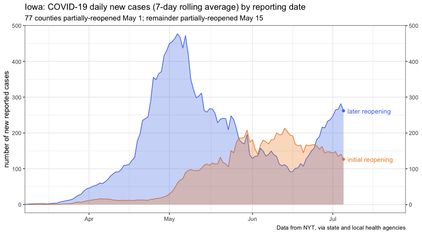<!-- -->

## Discussion

``` r
plot_cases
```

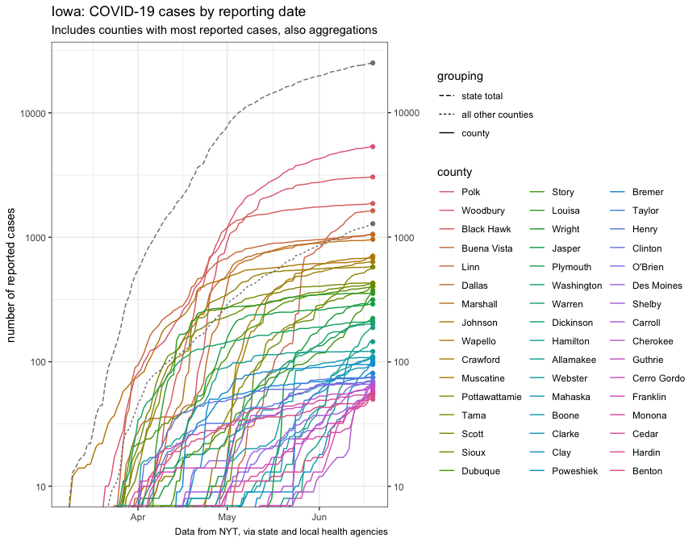<!-- -->

For another view, here’s an [FT-style
chart](https://www.ft.com/coronavirus-latest):

``` r
plot_cases_ft
```

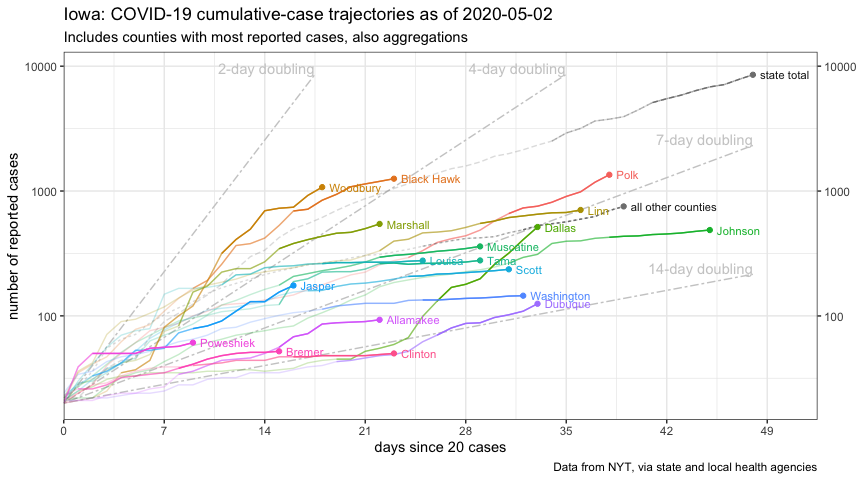<!-- -->

``` r
plot_new_cases_week_avg
```

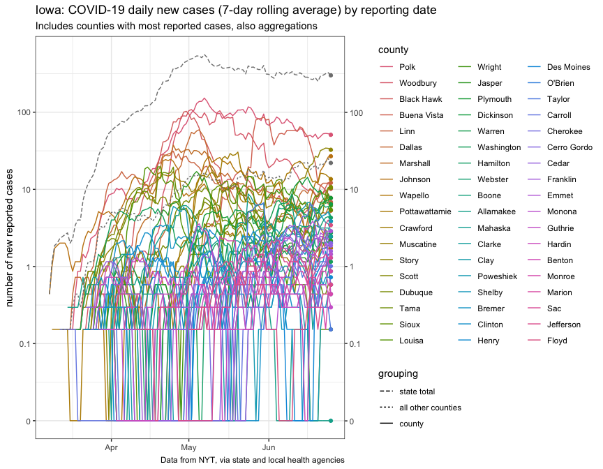<!-- -->

``` r
plot_new_cases_week_avg_ft
```

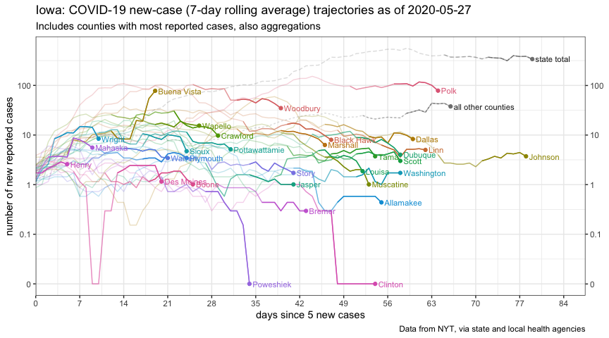<!-- -->

``` r
plot_iowa_map_group
```

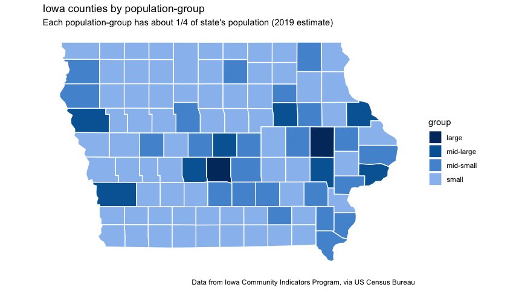<!-- -->

``` r
plot_iowa_proportions
```

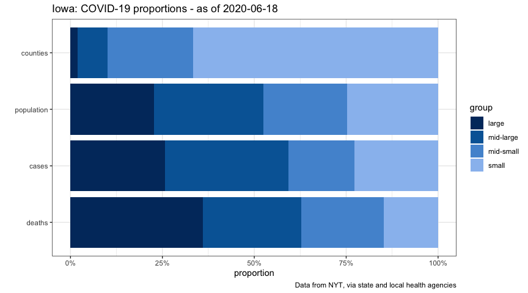<!-- -->

``` r
plot_cases_group
```

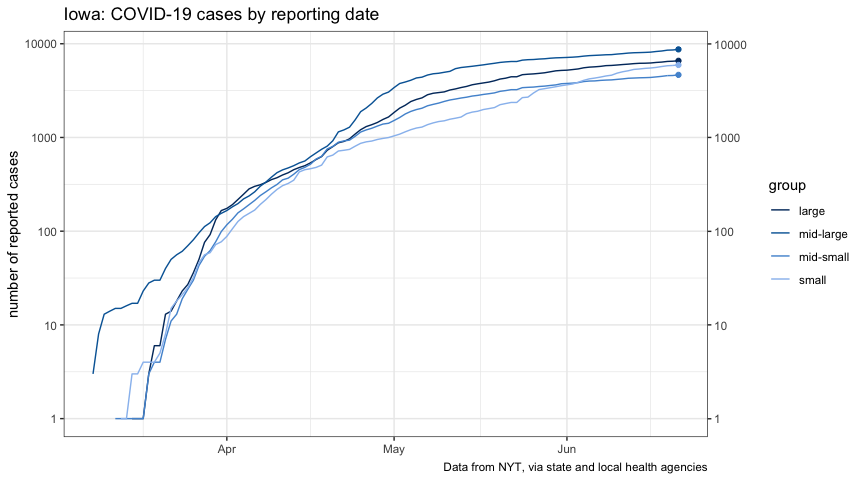<!-- -->

``` r
plot_new_cases_group
```

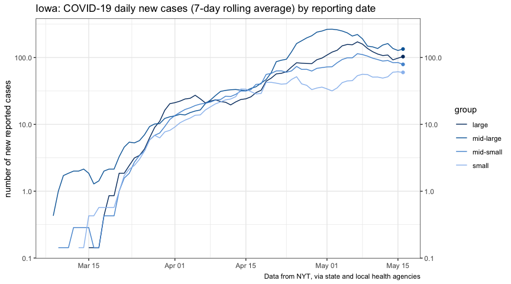<!-- -->

``` r
plot_cases_group_ft
```

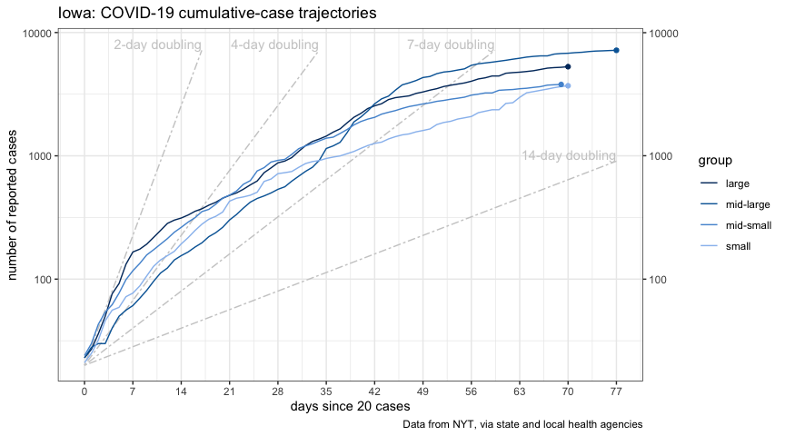<!-- -->

``` r
plot_new_cases_group_ft
```

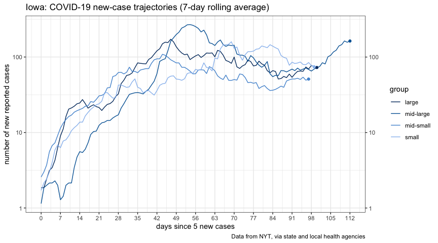<!-- -->

``` r
plot_iowa_deaths_ft
```

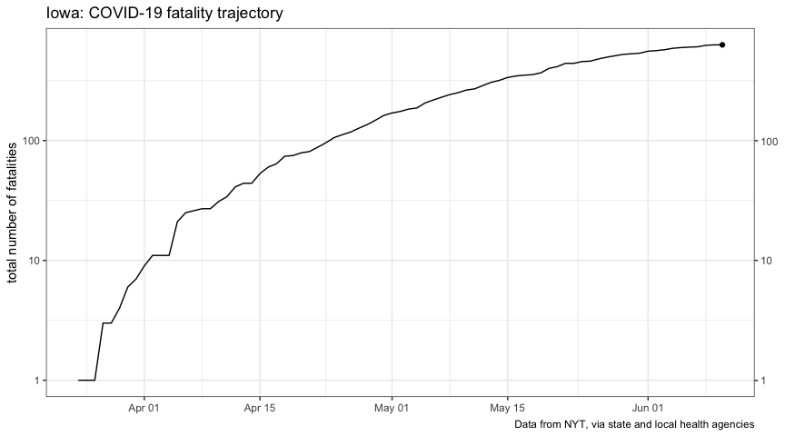<!-- -->

``` r
plot_reopen_cases
```

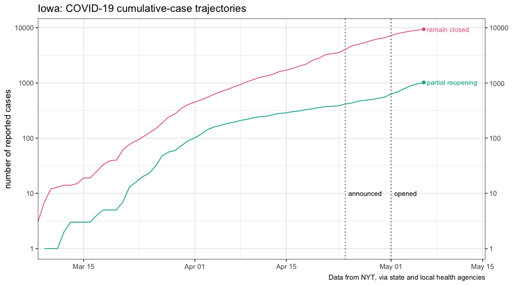<!-- -->

``` r
plot_reopen_new_cases
```

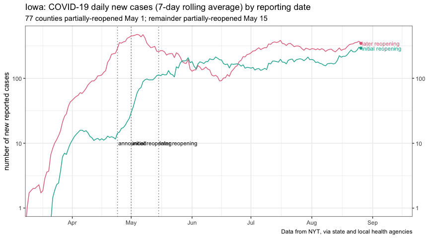<!-- -->

``` r
plot_reopen_new_cases_linear
```

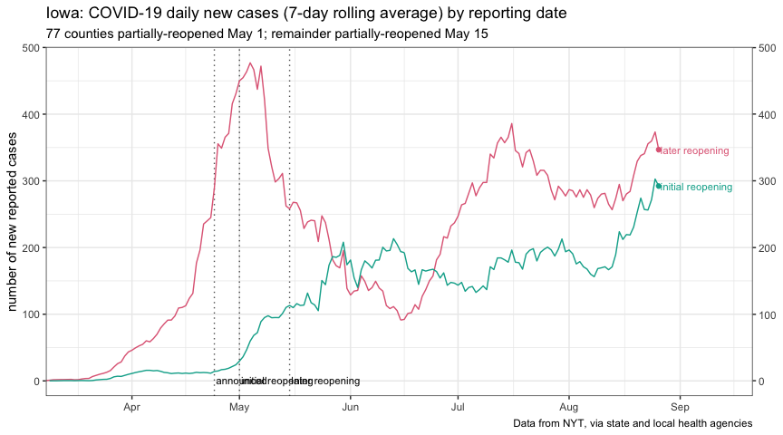<!-- -->
